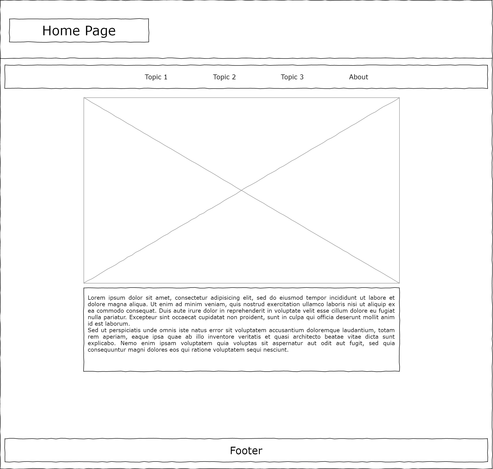
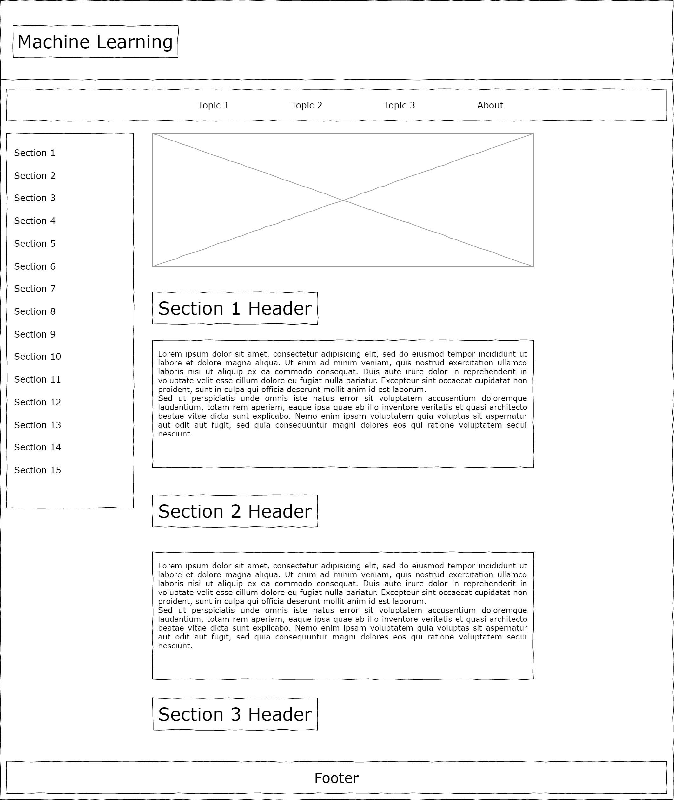
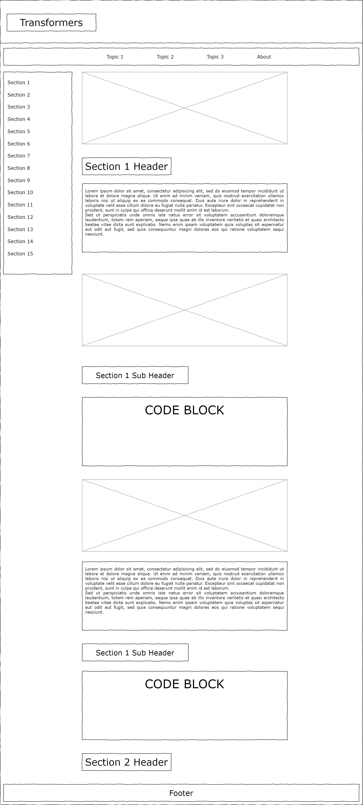
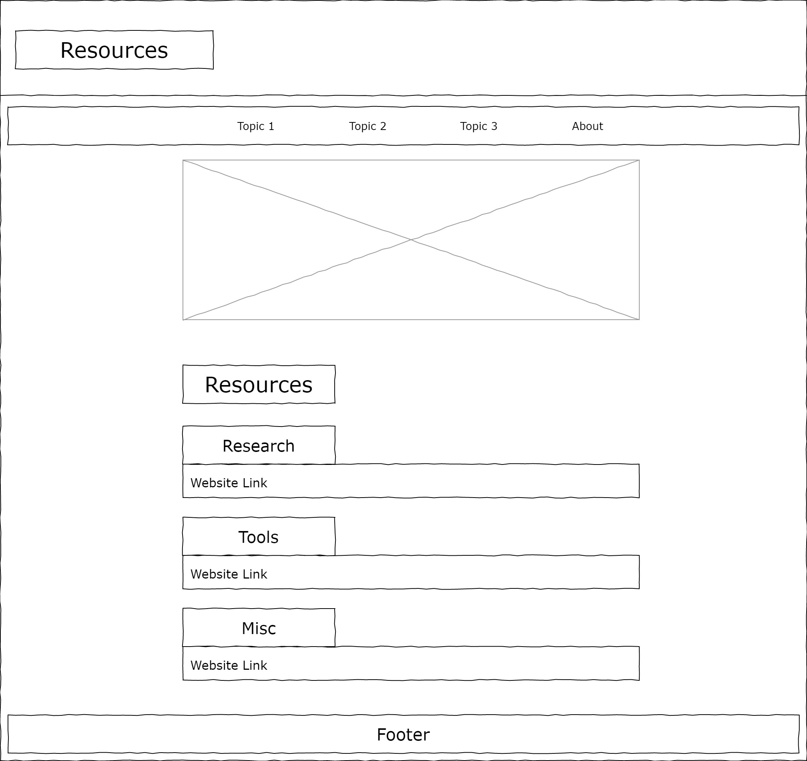
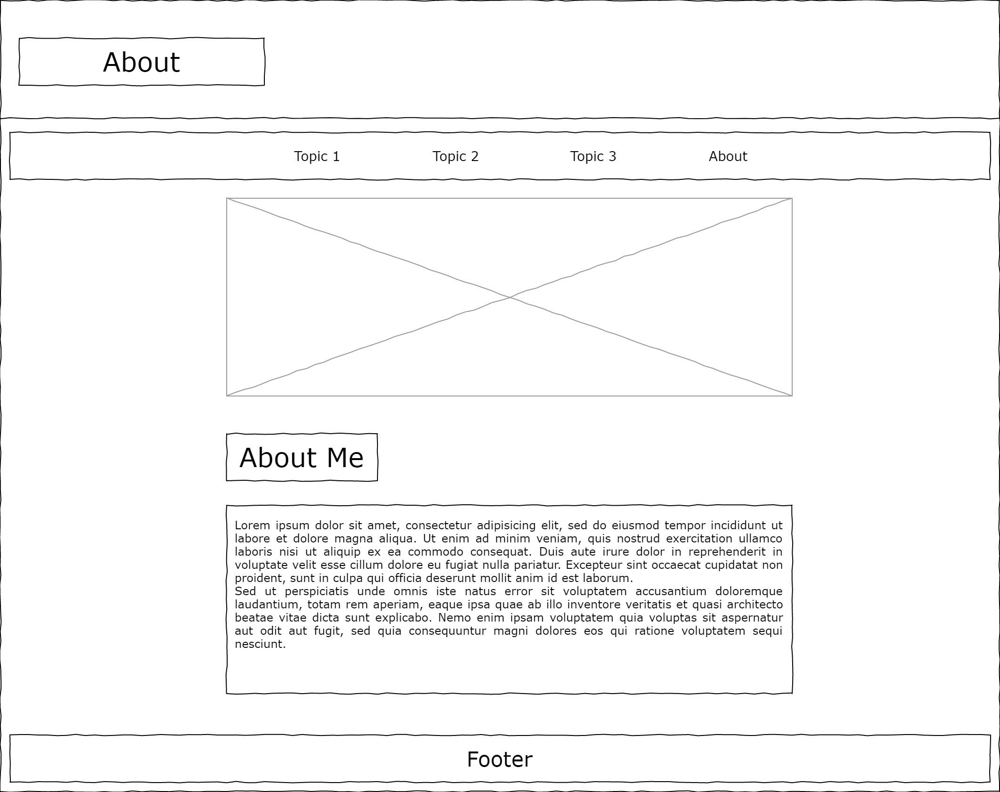

# Design Plan for Transformers Tutorial 
The website will primarly be giving a tutorial on the use of 'out of the box' transformers from the Huggingface Transformers library. There will also be a brief intro to machine learning expressed in laymen's terms with no accompaning math. I'm aiming for so simple my dad can do it. 

## Page Layout Wireframes
I'll be aiming for a older look with this website. The homepage will link to any other page through a navbar. The navbar and the footer will be persistent between pages

### Home Page

### Intro to Machine Learning
The side navigator should be sticky and persistant, we used to do that with frames, not here though. This will give a quick introduction to machine learning. 

### Transformers
Another sticky side navigator. The content itself will contain code blocks from my colab and an explanation of the transformer model with pictures. 

### Resources
This will link to the host of sources I've had to pile through to get my transformer to work. 

### About page
Just a bio

## Site Map

## Color Scheme

I'm using a simple ascetic color scheme, an off white #f0ebff and an off black #2e2e2e. The white might be too colorful. 

